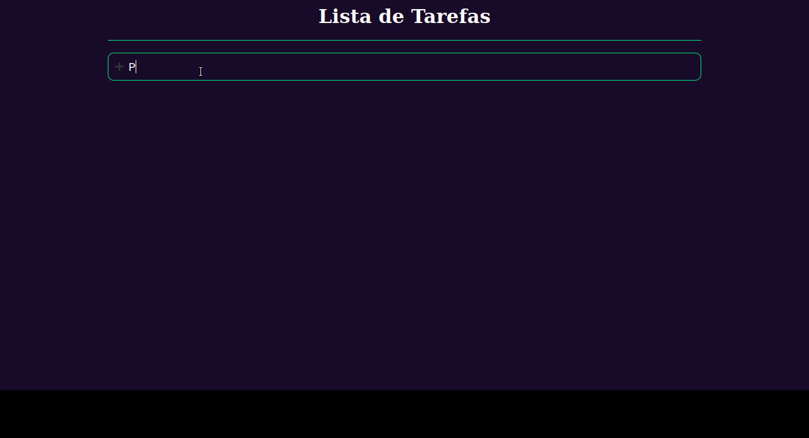
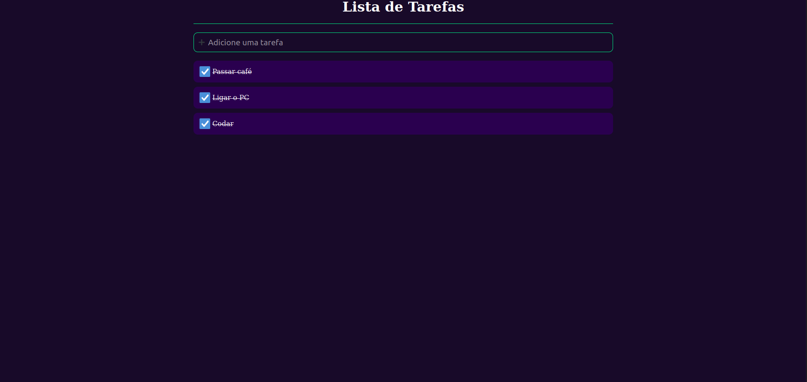

# To-do List
<h1 align="center">
  
</h1>

  

 

## 💻 Projeto

O To-do List é uma aplicação para controle de tarefas, onde se pode criar novas tarefas e "riscar" da sua lista as que já forem concluídas.

## 🚀 Tecnologias

Projeto desenvolvido com as seguintes tecnologias:

- ReactJS
- TypeScript
- useState (hook que armazena dados que podem variar com o tempo, qualquer informação ou dado deve ser armazenado no useState, só assim será possível renderizar a informação para o frontend web ou mobile)
- Styled Components (biblioteca que permite escrever códigos CSS dentro do Javascript)

---

Por Murilo Lopes
